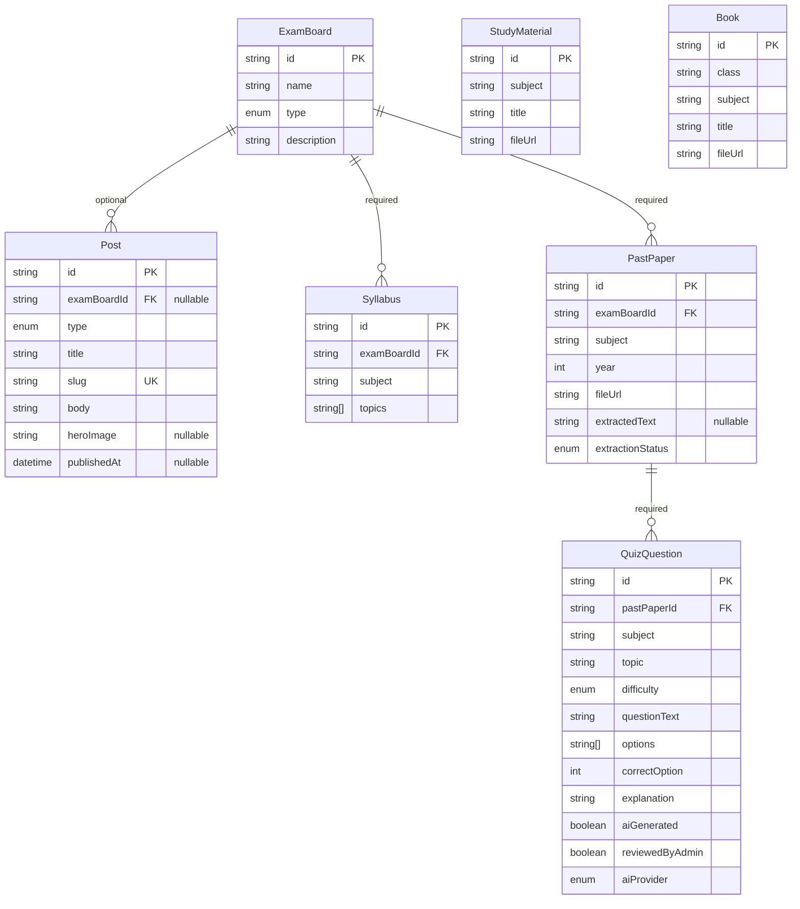

# Content Data Model

Covers `TAPS-2.1`. Source of truth for the actual schema is always
`apps/api/prisma/schema.prisma` — this doc explains the shape and the decisions behind it; if the
two ever disagree, the `.prisma` file wins and this doc is stale and needs updating.

## Scope

`05-ARCHITECTURE.md` §4 lists ten models. This schema implements the six that belong to **EPIC 2:
Content data model + CMS/admin** — `ExamBoard`, `Post`, `Syllabus`, `PastPaper`, `StudyMaterial`,
`Book` — plus, as of `TAPS-4.1`, `QuizQuestion` (EPIC 4), added because it's the first concrete
output of `AIService.generateQuizFromPaper` and has a direct FK relation to `PastPaper`, and, as of
`TAPS-5.1`/`TAPS-5.2`, `User` and `QuizAttempt` (EPIC 5) — neither covered in the table below since
they aren't part of this doc's content-model scope; see `docs/api/user-auth.md` +
`docs/adr/014-user-auth-separate-from-admin-auth.md` for `User`, and `docs/api/quiz-attempts.md` +
`docs/adr/015-quiz-attempt-data-shape.md` for `QuizAttempt` (which references `ExamBoard` directly
and `QuizQuestion` only indirectly, via a stored list of ids — no separate `Quiz`/`QuizSession`
model). `StudyPlan` belongs to a later epic (8) and is intentionally not in this schema yet —
adding it here would be scope creep ahead of the story that actually needs it.

## Models

| Model           | Key fields                                                                                                                                                                                                                                                                                                                                                                           | Relations                                                  |
| --------------- | ------------------------------------------------------------------------------------------------------------------------------------------------------------------------------------------------------------------------------------------------------------------------------------------------------------------------------------------------------------------------------------ | ---------------------------------------------------------- |
| `ExamBoard`     | `name` (unique), `type` (`TEACHING` \| `TET`), `description`                                                                                                                                                                                                                                                                                                                         | has many `Post`, `Syllabus`, `PastPaper`                   |
| `Post`          | `type` (`NOTIFICATION` \| `ARTICLE`), `title`, `slug` (unique), `body`, `heroImage?`, `publishedAt?`                                                                                                                                                                                                                                                                                 | belongs to `ExamBoard` (**optional**)                      |
| `Syllabus`      | `subject`, `topics` (`String[]`)                                                                                                                                                                                                                                                                                                                                                     | belongs to `ExamBoard` (required)                          |
| `PastPaper`     | `subject`, `year`, `fileUrl`, `extractedText?`, `extractionStatus` (`PENDING` \| `DONE` \| `FAILED`)                                                                                                                                                                                                                                                                                 | belongs to `ExamBoard` (required); has many `QuizQuestion` |
| `QuizQuestion`  | `subject`, `topic`, `difficulty` (`EASY` \| `MEDIUM` \| `HARD`), `questionText`, `options` (`String[]`), `correctOption`, `explanation`, `aiGenerated` (default `true`), `reviewedByAdmin` (default `false`), `aiProvider` (`ANTHROPIC` \| `OPENAI`, default `ANTHROPIC`), `createdAt` (no `updatedAt` — rows are write-once from generation until a future admin-review/edit story) | belongs to `PastPaper` (required)                          |
| `StudyMaterial` | `subject`, `title`, `fileUrl`                                                                                                                                                                                                                                                                                                                                                        | none — not board-specific per §4                           |
| `Book`          | `class`, `subject`, `title`, `fileUrl`                                                                                                                                                                                                                                                                                                                                               | none — not board-specific per §4                           |

Every model also has `id` (`String`, `cuid()`) and `createdAt`; every model except `QuizQuestion`
also has `updatedAt` — see `docs/adr/004-content-schema-design.md` for why, along with the id
strategy, the indexing choices, and the per-relation `onDelete` behavior (`SetNull` for `Post`'s
optional exam-board link, `Restrict` for `Syllabus`/`PastPaper`'s and `QuizQuestion`'s required
ones — `QuizQuestion`'s choice explained in `docs/adr/011-ai-quiz-generation.md`). `ExamBoard.name`
became unique in `TAPS-2.4`, added so the seed script (`docs/runbooks/database-seeding.md`) could
`upsert` idempotently by name — two exam boards sharing a name would be a data-integrity bug
regardless.

## Indexes

Single-column indexes on `examBoardId` (`Post`, `Syllabus`, `PastPaper`), `pastPaperId`
(`QuizQuestion`), `subject` (`Syllabus`, `PastPaper`, `StudyMaterial`, `Book`, `QuizQuestion`),
`topic` (`QuizQuestion`), `year` (`PastPaper`), `class` (`Book`), plus `Post.slug` (unique) and one
composite index, `PastPaper(examBoardId, subject, year)`, for the board+subject+year browse
pattern. Full rationale in `docs/adr/004-content-schema-design.md`.

## Migrations

`apps/api/prisma/migrations/20260910194813_init` is the first migration, applied and verified
against the real Neon database as part of `TAPS-2.2` — see
`docs/runbooks/database-migrations.md` for how to run migrations against Neon going forward, and
`docs/adr/003-prisma-orm-and-connection-strategy.md` for the Prisma version and connection-
handling decisions made while wiring it up. `..._examboard_name_unique` (`TAPS-2.4`) added the
`ExamBoard.name` unique constraint above; it was generated with `prisma migrate diff` and applied
with `prisma migrate deploy` rather than `prisma migrate dev`, which refuses to run in this
non-interactive environment (see the runbook). `..._add_pastpaper_extraction_fields` (`TAPS-4.0`)
added `PastPaper.extractedText`/`extractionStatus` above, also hand-written rather than from a raw
`prisma migrate dev` diff — see the runbook's "`migrate dev`'s autogenerated diff cannot be
trusted..." note for why. `..._add_quiz_question` (`TAPS-4.1`) added the `QuizQuestion` table
above, hand-written for the same reason — this schema's generated `tsvector` columns
(`TAPS-3.4`) make `prisma migrate diff`'s raw output against the full schema untrustworthy
regardless of which table the real change targets, so the spurious `searchVector`-related
statements it produced were dropped and only the genuine `CREATE TABLE`/index/FK statements were
kept. `..._add_ai_provider` (`TAPS-4.2`) added the `AIProvider` enum and `QuizQuestion.aiProvider`
above, hand-written for the same reason — see `docs/adr/012-ai-provider-fallback.md`.

## Diagram

