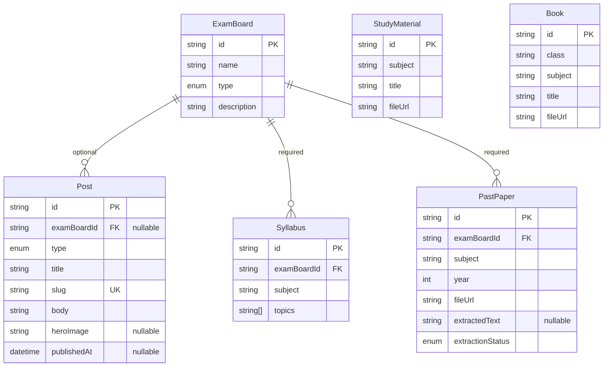

# Content Data Model

Covers `TAPS-2.1`. Source of truth for the actual schema is always
`apps/api/prisma/schema.prisma` — this doc explains the shape and the decisions behind it; if the
two ever disagree, the `.prisma` file wins and this doc is stale and needs updating.

## Scope

`05-ARCHITECTURE.md` §4 lists ten models. This schema implements the six that belong to **EPIC 2:
Content data model + CMS/admin** — `ExamBoard`, `Post`, `Syllabus`, `PastPaper`, `StudyMaterial`,
`Book`. `User`, `QuizQuestion`, `QuizAttempt`, and `StudyPlan` belong to later epics (5, 4, 7, 8)
and are intentionally not in this schema yet — adding them here would be scope creep ahead of the
stories that actually need them.

## Models

| Model           | Key fields                                                                                           | Relations                                |
| --------------- | ---------------------------------------------------------------------------------------------------- | ---------------------------------------- |
| `ExamBoard`     | `name` (unique), `type` (`TEACHING` \| `TET`), `description`                                         | has many `Post`, `Syllabus`, `PastPaper` |
| `Post`          | `type` (`NOTIFICATION` \| `ARTICLE`), `title`, `slug` (unique), `body`, `heroImage?`, `publishedAt?` | belongs to `ExamBoard` (**optional**)    |
| `Syllabus`      | `subject`, `topics` (`String[]`)                                                                     | belongs to `ExamBoard` (required)        |
| `PastPaper`     | `subject`, `year`, `fileUrl`, `extractedText?`, `extractionStatus` (`PENDING` \| `DONE` \| `FAILED`) | belongs to `ExamBoard` (required)        |
| `StudyMaterial` | `subject`, `title`, `fileUrl`                                                                        | none — not board-specific per §4         |
| `Book`          | `class`, `subject`, `title`, `fileUrl`                                                               | none — not board-specific per §4         |

Every model also has `id` (`String`, `cuid()`), `createdAt`, and `updatedAt` — see
`docs/adr/004-content-schema-design.md` for why, along with the id strategy, the indexing choices,
and the per-relation `onDelete` behavior (`SetNull` for `Post`'s optional exam-board link,
`Restrict` for `Syllabus`/`PastPaper`'s required ones). `ExamBoard.name` became unique in
`TAPS-2.4`, added so the seed script (`docs/runbooks/database-seeding.md`) could `upsert`
idempotently by name — two exam boards sharing a name would be a data-integrity bug regardless.

## Indexes

Single-column indexes on `examBoardId` (`Post`, `Syllabus`, `PastPaper`), `subject` (`Syllabus`,
`PastPaper`, `StudyMaterial`, `Book`), `year` (`PastPaper`), `class` (`Book`), plus `Post.slug`
(unique) and one composite index, `PastPaper(examBoardId, subject, year)`, for the board+subject+
year browse pattern. Full rationale in `docs/adr/004-content-schema-design.md`.

## Migrations

`apps/api/prisma/migrations/20260910194813_init` is the first migration, applied and verified
against the real Neon database as part of `TAPS-2.2` — see
`docs/runbooks/database-migrations.md` for how to run migrations against Neon going forward, and
`docs/adr/003-prisma-orm-and-connection-strategy.md` for the Prisma version and connection-
handling decisions made while wiring it up. `..._examboard_name_unique` (`TAPS-2.4`) added the
`ExamBoard.name` unique constraint above; it was generated with `prisma migrate diff` and applied
with `prisma migrate deploy` rather than `prisma migrate dev`, which refuses to run in this
non-interactive environment (see the runbook). `..._add_pastpaper_extraction_fields` (`TAPS-4.0`)
added `PastPaper.extractedText`/`extractionStatus` above, also hand-written rather than from a raw
`prisma migrate dev` diff — see the runbook's "`migrate dev`'s autogenerated diff cannot be
trusted..." note for why.

## Diagram

